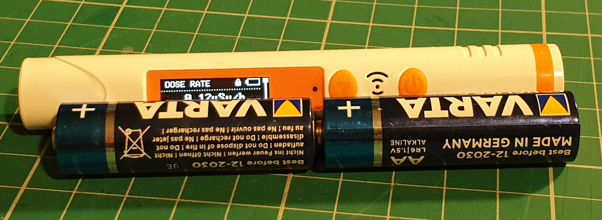
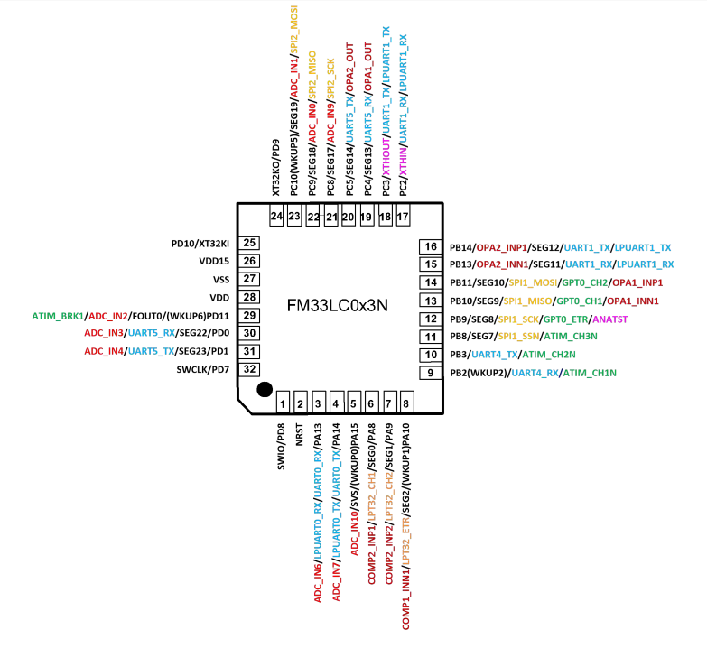
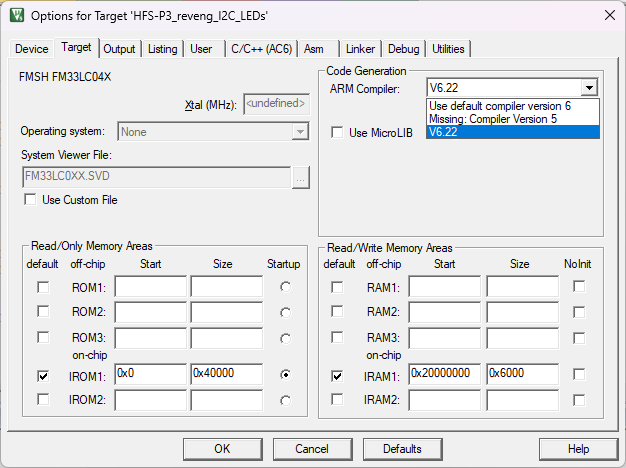
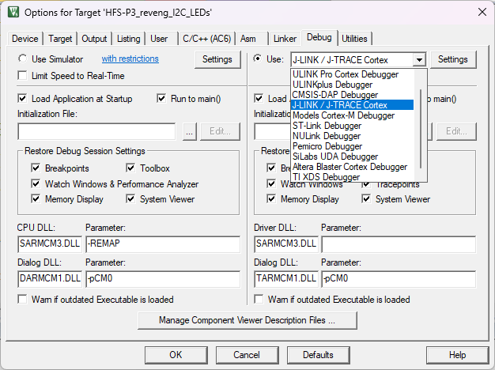

# HFS-P3_DevKit
Developping Kit and resources gathered while reverse engineering the chinese HFS-P3 radiation dosimeter pen.

https://github.com/user-attachments/assets/4a36b4d5-3909-4819-be21-2b176fe915f6

:point_down: <sub>Eeach section can be expanded</sub> :point_down:

<details>
<summary> <font size="4"> <strong> 1. Device Pictures </strong> </font></summary>

|                   |                            |                            |
|-------------------|----------------------------|----------------------------|
|**External Photos**| |  |
|**Internal Photos**|  |  |

* Some of the pictures are extracted from radmon.org, so credits to Simomax who thurughly documented this.
</details>

<details>
<summary> <font size="4"> <strong> 2. Device Specs </strong> </font></summary>

| Component         | Specification                |
|-------------------|------------------------------|
| MCU               | FM33LC043N - Arm Cortex M0    |
| GM Tube           | HH614                         |
| Screen            | 128x32 / 14 pin SSD1316 OLED  |
| Battery           | 150 mAh                       |
| Ports             | USB-C power only              |
| Debug interface   | SWD                           |
| Buttons           | #1 Menu/Down <br> #2 Power    |
| LEDs              | LED1 Green <br> LED2 Red      |
| Other             | #1 Buzzer                     |


</details>


<details>
<summary> <font size="4"> <strong> 3. Board Schematic </strong> </font></summary>

[EasyEDA Pro Project](resources/EasyEDA_ProProject_HFS-P3_schematic_2024-08-10.epro) of the Schematic  

[PDF ](resources/HFS-P3_rev_eng_schematic_2024-08-10.pdf) Schematic  

</details>

<details>
<summary> <font size="4"> <strong> 4. MCU Specs & GPIOs </strong> </font></summary>  

Check __datasheet__ [here](resources/FUDAN-MICRO-FM33LC0xx_v2021.09_datasheet.pdf).  

The **FM33LC043N** is a low power 64MHz Arm Cortex M0 MCU with **256KB Flash** and **24KB of SRAM** in a QFN32 form. It has 32 pins with 28 GPIOs, (of which 1xSWD, 2xSPIs and 4/2 UART/LPUART interfaces, 9x12bit SAR-ADC channels) and an internal temperature sensor. It lacks USB support and I2C so the latter needs to be bit-banged (as it will be required for oled driver communication).


- <details>
    <summary><strong>Specs Summary: </strong></summary>

    |                     | FM33LC0x3N |
    |---------------------|------------|
    | **CPU**             | Cortex-M0  |
    | **Max Freq.**       |   64MHz    |
    | **Flash**           | 256KB      |
    | **RAM**             | 24KB       |
    | **AES**             |  1         |
    | **RNG**             |  1         |
    | **Timer**           |  1         |
    | ATIM                |  1         |
    | GTIM                |  2         |
    | BSTIM32             |  1         |
    | LPTIM32             |  1         |
    | systick             |  1         |
    | **RTC/WWDT/IWD T**  | 1/1/1      |
    | **SPI**             | 2          |
    | **I2C**             | -          |
    | **UART**            | 4          |
    | **LPUART**          | -          |
    | **USB1.1 FS**       | -          |
    | **GPIO**            | 28         |
    | **OPA**             | 2          |
    | **12bit SAR-ADC**   | 9ch        |
    | **TempSensor**      |  1         |

    </details>

- <details>
    <summary><strong> MCU Pinout: </strong></summary>

    

  </details>

- <details>
    <summary><strong>HFS-P3 Pinout: </strong></summary>

    - On the HFS-P3 board the MCU has the following GPIOs connections:

      |Pin#|GPIO|  Function  |Config|
      |----|----|------------|------|
      |1   |**PD8** | SWD SWDIO  |
      |2   |**NRST**| Global Reset|
      |3   |**PA13**| OLED Reset |output, internal pull-up
      |4   |**PA14**|HV PSU? | output, internal pull-down
      |5   |PA15|NC          |
      |6   |**PA8** |GM pulse| input, external pull-up
      |7   |PA9 |NC          |
      |8   |PA10|NC          |
      |9   |**PB2** |PWR button (WKUP2)| WKUP2, internal pull-up, falling edge
      |10  |**PB3** |PWR Enable  | output, internal pull-down
      |11  |**PB8** |USB sense   | input, internal pull-down
      |12  |PB9 |NC          |
      |13  |PB10|NC          |
      |14  |**PB11**|BUZZER  | output, internal pull-down
      |15  |PB13|NC          |
      |... |... |NC          |
      |20  |PC5 |NC          |
      |21  |**PC8** |BATT voltage| input, ADC_IN9
      |22  |PC9 |NC          |
      |23  |**PC10**|MENU button |input, internal pull-up
      |24  |**PD9** | LED1(red)  |output, internal pull-down
      |25  |**PD10**| LED2(green)|output, interanl pull-down
      |26  |VDD15|LDO output |
      |27  |VSS |Ground      |
      |28  |VDD |Source      |
      |29  |**PD11**|RCC_FOUT0 (clock frequency output)|
      |30  |**PD0** |OLED SDA    |output, open drain, external pull-up
      |31  |**PD1** |OLED SCL    |output, open drain, external pull-up
      |32  |**PD7** |SWD SWCLK   |

  </details>

</details>

<details>
<summary> <font size="4"> <strong> 5. Links & Resources </strong> </font> </summary>

|  Item  |Description|  URL   |
|--------|-----------|--------|
|MFANG Tool - Fudan Micro Online Platform | Online GUI Platform to build MDK-ARM Keil uVision Base Projects (Clock setup, GPIOs, Debug interface)| https://mfang2.fmdevelopers.com.cn |
| FM33LC0XXN DevBoard User Manual | Blog Post With step by step instructions on chip schematic, capailites and developpment environment setup including MFANG base project generation, Arm Keil MDK uVison setup and Project Examples. | https://www.yuque.com/xinluyao/fm33lc0xxn |
| Fudan Micro Developpers Official Forum | Example Projects and different coding/developpment issues  | https://www.fmdevelopers.com.cn/forum.php?mod=viewthread&tid=1749 |
| Radmon Forum  | Forum where I first found thurough documentation about this device. The thread eventually stalled due to SWD connection issues, that luckily I figured | https://radmon.org/index.php/forum/commericial-geiger-counters/1287-hfs-p3-pen-geiger-counter-dosimeter |


</details>


---------------------
### I. Prepairing
<details>
    <summary>Click to Expand</summary>


#### 1. Wiring:

Note: SWD will not work if battery is desoldered. Connecting the 3.3v line to the +V input on the board will make it enter debug mode again.
#### 2. Programmer & Software:

I used a chinese ST-Link V2 clone with the firmware modified to work with [J-Link Commander](https://www.segger.com/downloads/jlink/). This was really messy<sup><font color="red">*</font></sup> so my recommandation is to use a proper [Segger JLink debug probe](https://www.segger.com/products/debug-probes/j-link/).

With an original J-Link debug probe you might be able to use any version of [J-Link Commander](https://www.segger.com/downloads/jlink/). For my clone, only a couple of versions seemed to have worked (v6.18c, v6.12).

<font color="red">*</font><sub>You need [SEGGER STLinkReflash Utility](https://www.segger.com/products/debug-probes/j-link/models/other-j-links/st-link-on-board/) to flash `J-Link firmware` in place of `STLink` (same app will be able to restore it if ever needed). If the debugger is a chinese clone you might have to use a [patched](resources/STLinkReflash_190812) version of the reflash utility instead to bypass the error of the unsupported device.</sub></font>

:exclamation: Once J-Link is installed make sure to add the **Fudan Micro memory maps** according to [readme](resources/JFlash/Fudan%20Devices%20List/)

#### 3. Dumping
1. Connect the debug probe to the board
2. Plug the USB inside the PC (currently only Windows 10/11 tested)
3. Run `J-Link Commander` as Administrator
4. Type `connect` -> choose `FM33LC04X` (see [here](resources/JFlash/Fudan%20Devices%20List/) if FMSH is not in list) -> type `S` for SWD -> enter for default `4000KHz `speed. If any error at this point run `connect` again and agin until the debug probe succesfully halts the cpu and establishes a connection (see below).


To dump the flash use the `savebin` command: 

`savebin <filename>, <addr>, <NumBytes> (hex)`
```
savebin C:\path\where\to\dump.bin, 0x0, 40000
```


`0x0` is the start address, `40000` is the number of bytes (in hex) to dump (according to datasheet that is the size of the flash), in this case `40000 hex = 262144 Bytes`:

#### 4. Downloading to Flash

<sub>You can either use *J-Link commander* or *Keil uVision MDK-ARM*. The latter will be described later.</sub>

To Download a binary to flash with *J-Link Commander* use the `loadbin` command:

`loadbin <filename>, <addr>`
```
loadbin C:\path\of\the\file_to_flash.bin, 0x0
```


</details>

### II. IDE Setup (Keil µVision 5 MDK-ARM)
<details>
    <summary>Click to Expand</summary>

- Download and Install the [MDK-ARM software](https://www.keil.com/demo/eval/arm.htm#/DOWNLOAD)
- Open project: `/project/Keil_Project/MDK-ARM/*.uvoptx`
- Make sure compiler is selected in project options `Project` -> `Options for Target ...`, under `Target` tab:

- Make sure `JLINK` is selected as debugger in `Debug` tab.

- Compile using upper left `Build` icon

- Upload/Download to Flash using upper left `Download` icon:
  

:exclamation:__*Note:*__
Sometimes, in my case, I had to start `J-Link Commander`, establish a connection with it and only then Keil uVision would detect the MCU.

</details>